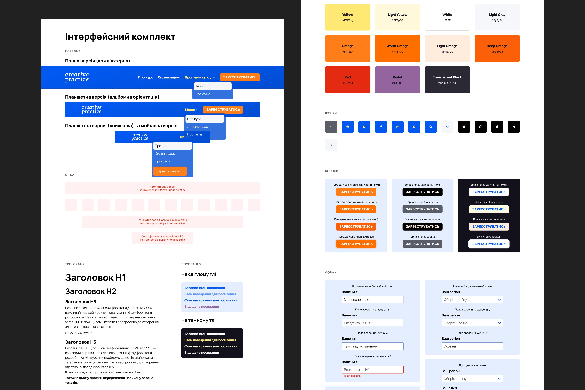

# Creating a UI Kit: a case study for Creative Practice #4

## The outlines
As a UX/UI designer, it was important for me to learn the basics of the front-end for my work to:
* Build better ideas based on feasible solutions
* Know the potential boundaries, what’s possible/impossible to create
* To be more effective in working with the development team and understand their language

I started studying at Creative Practice and have already learned Visual Studio Code, the basic principles of HTML. In previous classes, I've found out how to connect CSS, make tables, and work with the block model, CSS selectors, pseudo-classes, pseudo-elements, and cross-platform. Also, I got acquainted with the flexboxes, grids, and position of elements and have created the form using common form elements.

I'm completing the front-end web development course from Creative Practice, and the last work is to create a landing page. The development of the site is divided into two parts. In the first, I need to create a UI Kit, in the second, I need to create a site based on the design layout and UI Kit.

## The goal
Build front-end web UI Kit

## The process and the result
I made the blocks of the graphic interface kit. It includes elements of brand identity:
1. Modular grid with different numbers of columns, rows, and indents between them
2. Typography (fonts, sizes of headings, body text, indents between text blocks)
3. Colors (I added colors from the palette using CSS custom properties)
4. Images
5. Visual forms

Also, I created such interface elements as buttons, checkboxes, links, forms with input fields, icons, and menus in their various states.

As a result, I got a flexible way to customize components from the UI Kit for different types of devices.
